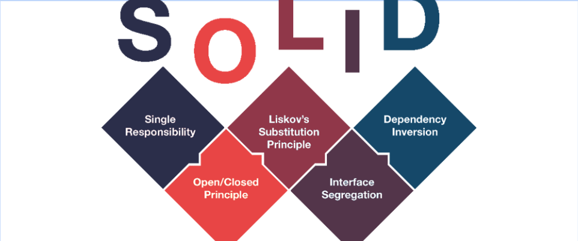

# SOLID
1. Khái niệm
- SOLID là tập hợp 5 nguyên tắc thiết kế phần mềm giúp tạo ra mã nguồn dễ bảo trì, mở rộng và linh hoạt hơn.


## Các nguyên tắc

1. Nguyên tắc đơn trách nhiệm

- S - Single Responsibility Principle (SRP) - Nguyên tắc đơn trách nhiệm.

    - Mỗi phần của chương trình chỉ nên làm một việc duy nhất. Nếu một phần có nhiều nhiệm vụ, nó sẽ khó bảo trì và dễ gây lỗi khi thay đổi..
    - Giúp mã nguồn dễ bảo trì, dễ mở rộng và dễ kiểm thử hơn.


```cpp
class Sensor
{
    public:
        // Xử lý dữ liệu
        void processData(){}
       
        // Lưu trữ dữ liệu
        void saveData(){}

        // Gửi dữ liệu đi
        void sendData(){}
};

===>   
// Class xử lý dữ liệu
class Process
{
    public:
        void processData(){}
};

// Class lưu trữ dữ liệu
class Save
{
    public:
        void saveData(){}
};

// Class gửi dữ liệu
class Send
{
    public:
        void sendData(){}
};
```
* Mỗi class chỉ xử lí 1 vấn đề
2. Nguyên tăc đóng mở
- O - Open/Closed Principle (OCP) - Nguyên tắc đóng mở  
    - Cho phép mở rộng nhưng không sửa đổi mã cũ. Khi cần thêm tính năng mới, hãy thêm mã mới thay vì chỉnh sửa mã hiện có.
    - Tránh sửa đối mã nguồn cũ.

3. Nguyên tắc thay thế Liskov


4. Nguyên tắc phân tách giao diện

5. Nguyên tắc đảo ngược sự phụ thuộc

```
Chữ cái | Tên đầy đủ | Tiếng Việt
S  | Single Responsibility Principle | Nguyên lý đơn nhiệm vụ
O  | Open/Closed Principle           | Mở rộng được, đóng sửa đổi
L  | Liskov Substitution Principle   | Thay thế được lớp cha
I  | Interface Segregation Principle | Tách interface
D  | Dependency Inversion Principle  | Đảo ngược sự phụ thuộc
```