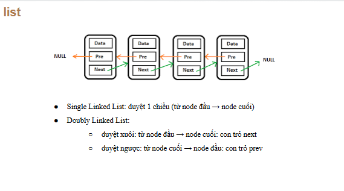

# List
- list là 1 container trong STL trong C++, triển khai dưới danh sách liên kết
- Một số đặc điểm quan trọng:
    - Truy cập tuần tự: Truy cập các phần tử của list, không hộ trợ ngẫu nhiên
    - Hiệu suất chèn và xóa: Chèn và xóa ở bất kỳ vị trí nào trong danh sách có hiệu suất tốt hơn __vector__. Điều này đặc biệt đúng khi *thêm/xóa* ở giữa danh sách
- Sự khác biệt biệt giữa DSLK đôi và đơn:


## Các hàm trong list 

### 1. Constructor

| Hàm                                   | Mô tả                                                |
| ------------------------------------- | ---------------------------------------------------- |
| `list()`                              | Khởi tạo danh sách rỗng.                             |
| `list(size_type n)`                   | Khởi tạo danh sách với `n` phần tử mặc định.         |
| `list(size_type n, const T& val)`     | Khởi tạo danh sách với `n` phần tử có giá trị `val`. |
| `list(iterator first, iterator last)` | Khởi tạo từ dải phần tử `[first, last)`.             |
| `list(const list& other)`             | Copy constructor.                                    |
| `list(list&& other)`                  | Move constructor.                                    |
| `list(std::initializer_list<T>)`      | Khởi tạo từ danh sách khởi tạo.                      |

### 2. Element access

| Hàm       | Mô tả                       |
| --------- | --------------------------- |
| `front()` | Truy cập phần tử đầu tiên.  |
| `back()`  | Truy cập phần tử cuối cùng. |

### 3. Iterators

| Hàm                  | Mô tả                     |
| -------------------- | ------------------------- |
| `begin(), end()`     | Trả về iterator đầu/cuối. |
| `rbegin(), rend()`   | Iterator ngược đầu/cuối. (Muốn sử dụng thì phải khai báo reverse_iterator) |
| `cbegin(), cend()`   | Iterator hằng.            |
| `crbegin(), crend()` | Iterator ngược hằng.(Muốn sử dụng thì phải khai báo reverse_iterator)      |

### 4. Capactity

| Hàm          | Mô tả                                 |
| ------------ | ------------------------------------- |
| `empty()`    | Kiểm tra danh sách có rỗng không.     |
| `size()`     | Trả về số phần tử.                    |
| `max_size()` | Trả về số phần tử tối đa có thể chứa. |

### 5. Modifiers

| Hàm                    | Mô tả                                         |
| ---------------------- | --------------------------------------------- |
| `assign(...)`          | Gán lại giá trị từ danh sách khác hoặc range. |
| `emplace_front(...)`   | Tạo phần tử tại đầu danh sách.                |
| `emplace_back(...)`    | Tạo phần tử tại cuối danh sách.               |
| `push_front(const T&)` | Thêm phần tử vào đầu.                         |
| `push_back(const T&)`  | Thêm phần tử vào cuối.                        |
| `pop_front()`          | Xoá phần tử đầu.                              |
| `pop_back()`           | Xoá phần tử cuối.                             |
| `insert(...)`          | Chèn phần tử tại vị trí.                      |
| `erase(...)`           | Xoá phần tử tại vị trí.                       |
| `emplace(...)`         | Tạo phần tử tại vị trí.                       |
| `clear()`              | Xoá toàn bộ phần tử.                          |
| `resize(n)`            | Thay đổi kích thước danh sách.                |
| `swap(list& other)`    | Hoán đổi nội dung hai danh sách.              |

### 6.Operations

| Hàm                    | Mô tả                                         |
| ---------------------- | --------------------------------------------- |
| `assign(...)`          | Gán lại giá trị từ danh sách khác hoặc range. |
| `emplace_front(...)`   | Tạo phần tử tại đầu danh sách.                |
| `emplace_back(...)`    | Tạo phần tử tại cuối danh sách.               |
| `push_front(const T&)` | Thêm phần tử vào đầu.                         |
| `push_back(const T&)`  | Thêm phần tử vào cuối.                        |
| `pop_front()`          | Xoá phần tử đầu.                              |
| `pop_back()`           | Xoá phần tử cuối.                             |
| `insert(...)`          | Chèn phần tử tại vị trí.                      |
| `erase(...)`           | Xoá phần tử tại vị trí.                       |
| `emplace(...)`         | Tạo phần tử tại vị trí.                       |
| `clear()`              | Xoá toàn bộ phần tử.                          |
| `resize(n)`            | Thay đổi kích thước danh sách.                |
| `swap(list& other)`    | Hoán đổi nội dung hai danh sách.              |


------------------------------------------------------------
- Trong vector, địa chỉ các ô là liền kề với nhau, nhưng trong list nó là độc lập, giống đúng tính chất của DSLK

### Các cách đọc dữ liệu trong list

1.  
```cpp
for(int i = 0; i < lst.size(); i++)
    {
        cout << lst.????;
    }

    ===> Output: Không thể làm được vì không có hàm built_in nào để lấy dữ liệu của node đó ra
```
2. Sử dụng for cải tiến (range-based for loop) 
```cpp
for(const auto& item : lst) // mỗi lần duyệt qua, item sẽ đọc dữ liệu của node đó
{
    cout << item << " ";
}
```
3. Iterator 
- Mỗi container có __Iterator__ của riêng nó
```cpp
list<int>::iterator it;

    for(it = lst.begin(); it != lst.end(); it ++)
    {
        cout << *it << " ";
    }
```

* Giờ muốn duyệt ngược lại thì sao?

```cpp
 for(it = lst.end(); it != lst.begin(); it --)
    {
        cout << *it << " ";
    }
    cout << endl;
```
* ==> Output: 9 20 15 10 5 4 3 2 1 --- Tại sao có thêm giá trị 9 và mất đi giá trị 25 ở ngay node đầu (1 giá trị rác) ?
    * Vì end là địa chỉ sau nốt cuối cùng, mà ở đó không có node nào cả

__Cách duyệt ngược__

- Cách 1: Sử dụng auto
```cpp
for(auto it1 = lst.rbegin(); it1 != lst.rend(); it1 ++)
    {
        cout << *it1 << " ";
    }
```

  - rbegin: reverse-begin (trỏ tới địa chỉ của nốt cuối cùng)
  - rend: reverse-end (trỏ tới __trước__ địa chỉ của node đầu tiên)

- Cách 2: Sử dụng reverse iterator

__CỨ MUỐN DUYỆT THEO CHIỀU NGƯỢC LẠI (rbegin. rend...) THÌ PHẢI DÙNG REVERSE_ITERATOR__

```cpp
list<int> ::reverse_iterator rit;

for (rit = lst.rbegin(); rit != lst.rend(); rit ++)
    {
        cout << *rit << " ";
    }
```

- Cách 3: Sử dụng vòng while
```cpp
it = lst.end();
while(it != lst.begin())
{
    cout << *(--it) << " ";
}
```

### Cách insert/erase giá trị ở vị trí bất kì
- INSERT
```cpp
lst.insert(lst.begin(), 12); // push front
    lst.insert(lst.end(), 13); // push back

    // lst.insert(lst.begin() + 1, 150); WRONG

    it = lst.begin();
    int index = -1;
    for(it = lst.begin(); it != lst.end(); it ++)
    {
        ++index;
        if(index == 4)
        {
            lst.insert(it, 150);
        }
    }
```
- ERASE
```cpp

    it = lst.begin();
    int index = -1;
    for(it = lst.begin(); it != lst.end(); it ++)
    {
        ++index;
        if(index == 4)
        {
            lst.erase(it);
        }
    }
```
- Ngoài ra có 1 hàm như sau
```cpp
lst.remove(index);

- Giả sử list = {1,1,2,3,4,5}; Nếu remove(1) thì nó sẽ remove tất cả giá trị 1 ==> Output 2 3 4 5
```