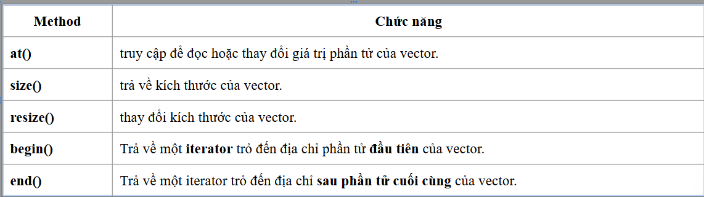
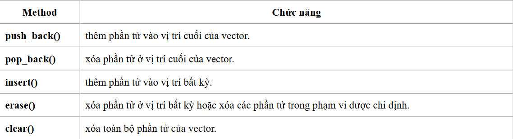

# STL (Standard Template Library)


## 1.Container

- 1 vài containers phổ biến:
    - vector: là mảng được cấp phát động
    - list
    - map
    - array
    - stack, queue

### 1.1 Vector
- **std::vector** là 1 mảng động trong C++. Nó tự động quản lý bộ nhớ, có thể tăng kích thước khi thêm phần tử mới, và cho phép truy cập ngẫu nhiên như mảng bình thường

- Cách triển khai vector
```cpp
vector<data_type> name;  // vector rỗng

vector<data_type> name(size);  // size là số lượng phần tử khởi tạo và giá trị khởi tạo mặc định là 0

vector<data_type> name(size, value);  // value: giá trị khởi tạo cho các phần tử

vector<data_type> name = {1, 2, 3, 4, 5};

```

- Một số method của vector:

- Một số method liên quan đến thêm/xóa phần tử của vector
- 

- Duyệt vector
```cpp
// Cách 1
    for (int i = 0; i < v.size(); ++i)
        cout << v[i] << " ";
// Cách 2
    for (int x : v)   // for cải tiến - C++11
        cout << x << " ";
// Cách 3   
    for (auto it = v.begin(); it != v.end(); ++it)
        cout << *it << " ";


```

### Iterator
- Hoạt động **giống** với con trỏ, tương tác với những địa chỉ
- Đây cũng là 1 class

