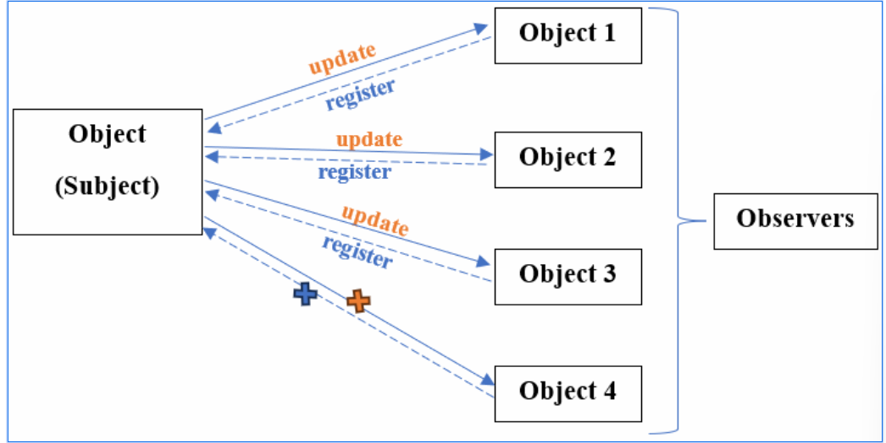

# OBSERVER PATTERN

- Là 1 mẫu thiết kế thuộc nhóm Behavioral, định nghĩa mối quan hệ phụ thuộc __one to many__ giữa các đối tượng, nghãi là khi __một đối tượng thay đổi trạng thái (Subject)__, tất cả các đối tượng phụ thuộc

- phải __register__ thì mới nhận được thông tin đã __update__

## Các thành phần chính:

- Subject
    - Đối tượng giữ trạng thái và chịu trách nhiệm thông báo cho các Observer về sự thay đổi
    - Cung cấp các phương thức để __thêm, xóa và thông báo__ Observer

- Observer
    - Một __interface__ định nghĩa phương thức cập nhật dữ liệu
    - Observer sẽ thực hiện hành động khi nhận được thông báo của Subject

- Concrete Observer

- Concrete Subject
