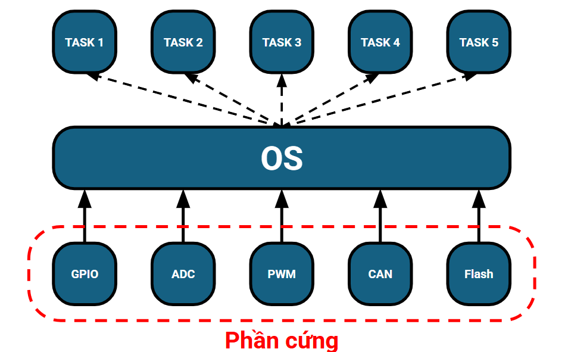
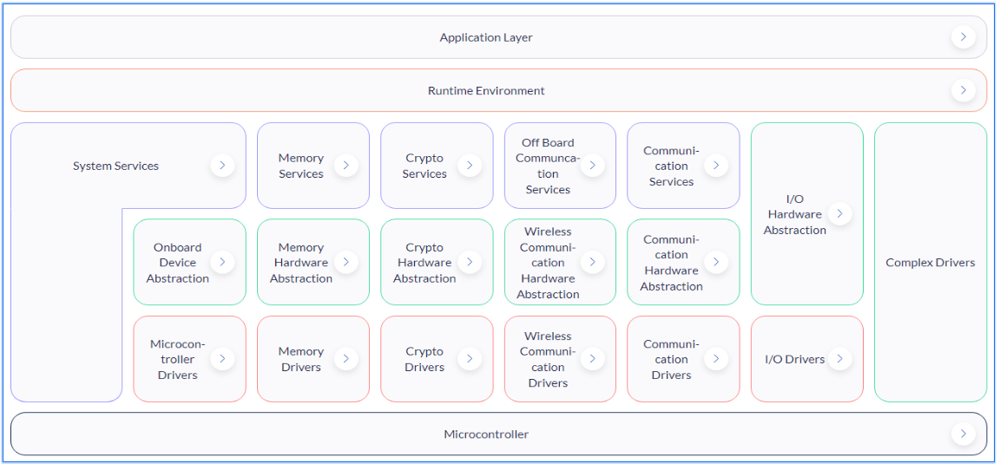
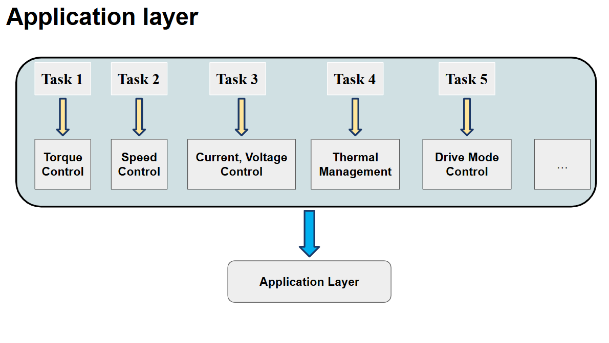
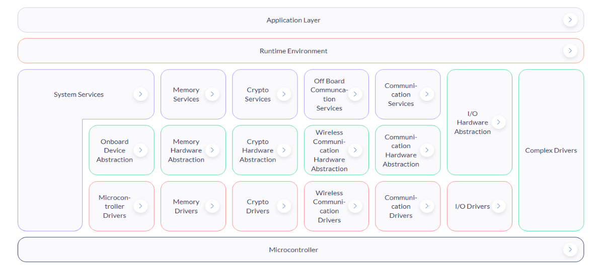

# OS
- Giúp các tác vụ chạy song song, và cũng đảm bảo chỉ 1 tác vụ chạy trong 1 thời điểm

# AUTOSAR CLASSIC
## 1. Là 1 tiêu chuẩn toàn cầu cho phát trienrer phần mềm ô tô với mục tiêu là chuẩn hóa kiến trúc phần mềm cho các hệ thống ECU, nhằm tăng tính khả chuyển, mở rộng và giảm chi phí phát triển

## 2. Kiến trúc Autosar classic

### 2.1 Application layer
- Lớp ứng dụng:
    - SWC (Software component), mỗi khối phần mềm ứng dụng thể  hiện 1 chức năng trong ECU system

    - Chỉ quan tâm đến logic, tính toán số như thế nào, không cần quan tâm đến phần cứng. Tuy nhiên, SWC vẫn có thể giao tiếp với nhau và giao tiếp với phần cứng thông qua RTE.

### 2.2 Runtime Environment (RTE)
- Đóng vai trò trong việc __kết nối__ SWC với BSW (Basic Software) thông qua OS
- Cung cấp cơ chế truyền thông để các SWC có thể trao đổi dữ liệu với nhau mà không cần biết chi tiết các phần còn lại của hệ thống. Ta hiểu đơn giản là chạy các hàm liên quan tới nhau giữa các SWC

### 2.3 Basic Software (BSW)
- Để RTE giao tiếp với BSW phải thông qua OS

- Được chia làm 3 phần
1. Service: Tầng xây dựng hệ điều hành, để các tầng phía dưới có thể sử dụng. Có nhiều cách khác nhau như tự viết hệ điều hành hay sử dụng thư viện để tạo ra các tính năng như communication, crpyto...
2. Tầng Abstraction: Giúp phần mềm giao tiếp phần cứng 1 cách trừu tượng, hiểu đơn giản là gọi hàm, nhưng hàm có thể bị giấu đi hoặc không
3. Tầng MCAL (Micro-controller abstraction layer): Tầng để cấu hình (Cấu hình GPIO, cấu hình mạng CAN...). Tầng này tương tác trực tiếp với phần cứng