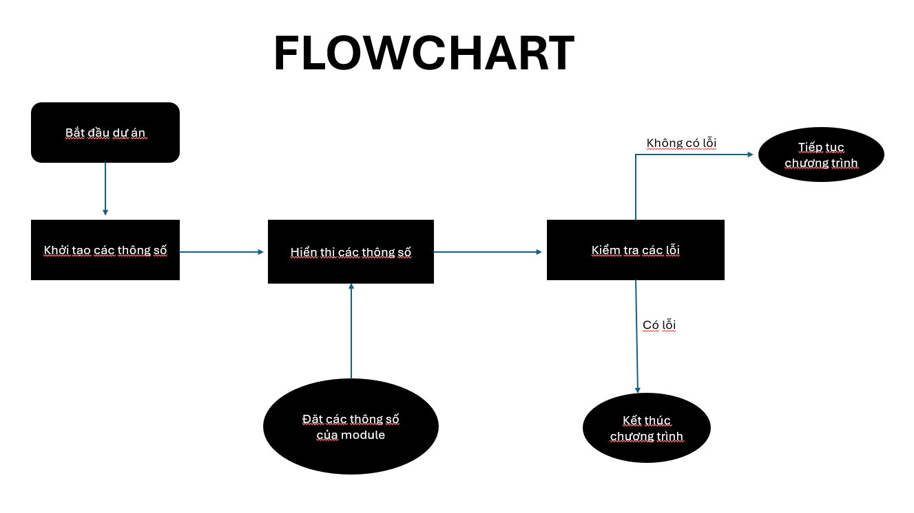

# Dự án thiết kế quản lý trạng thái Module trong hệ thống ô tô

## Thiết kế:
1. Sử dụng struct đồng thời kết hợp bit-field để lưu trữ thông tin module.
2. Khởi tạo các hàm bit-mask để bật, tắt, hiển thị thông tin...
3. Khởi tạo con trỏ hàm để quản lý các hàm bit-mask nhằm tiết kiệm bộ nhớ và linh hoạt hơn.
4. Khởi tạo các hàm xử lí lỗi khi chương trình xảy ra vấn đề, để có thể kết thúc không gây ảnh hưởng đến người dùng


## Cách sử dụng bitmask, function pointer, setjmp.
1. Bitmask:
- Ta khởi tạo các thông số thể hiện dưới dạng bit để tiết kiệm bộ nhớ và dễ thao tác hơn.
- Sau đó dùng các phép toán trên bit (bit manipulation) để thực hiện chương trình như ý muốn
- Ví dụ
```c
void enable_module(Module *module, uint8_t Status)
{
    module->status |= Status;
}
```
Ban đầu ta khởi tạo module->status = 0 (0...0000), khi muốn bật ta dùng toán tử OR ( | ), vì lúc 0 | 1 = 1, vậy nên chỉ cần Status có số 1 trong nó là sẽ bật.

2. Function pointer:
```c
void function_ptr(void (*func_ptr)(Module *, uint8_t), Module *module, uint8_t options)
{
  func_ptr(module, options);
}
```
- Vì hàm bật, tắt, đặt hành động đều có tham số đầu vào là kiểu Module *module, uint8_t options, nên cũng khai báo như vậy ở con trỏ hàm.
- Khi gán con trỏ hàm tới 1 hàm nào đó, nó sẽ trỏ tới địa chỉ của hàm đó và chạy hàm đó.

3. setjmp
- setjmp là một hàm có sẵn trong thư việt setjmp.h, nó giúp ta điều khiển luồng chương trình theo ý muốn.
- Ban đầu khởi tạo giá trị exception = 0, đồng nghĩa với TRY

```c
void warning_Message(Module module)
{
    if(module.addtionnal_Options <=WARNING_POINT_1 || module.addtionnal_Options >=WARNING_POINT_2)
    {THROW(WARNING, your module is encountering some problems );}
}

void error_Message(Module module)
{
    if(module.addtionnal_Options <= ERROR_POINT_1 || module.addtionnal_Options >=ERROR_POINT_2)
    {THROW(ERROR, your module is not active anymore!!! Back to default settings);}
}
```

tức ta sẽ chạy thử 2 hàm báo lỗi này, khi nó vào hàm đầu tiên nó sẽ kiểm tra các điều kiện, nếu như thỏa mãn thì hàm longjmp sẽ giúp nó nhảy tới giá trị x tiếp theo và thực thi các hàm trong CATCH sau đó thoát chương trình.


## Flowchart
